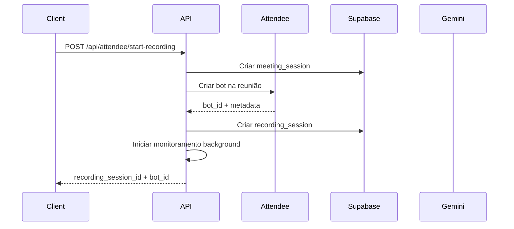
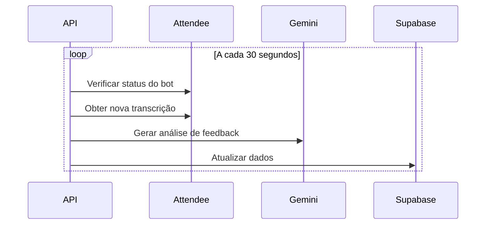
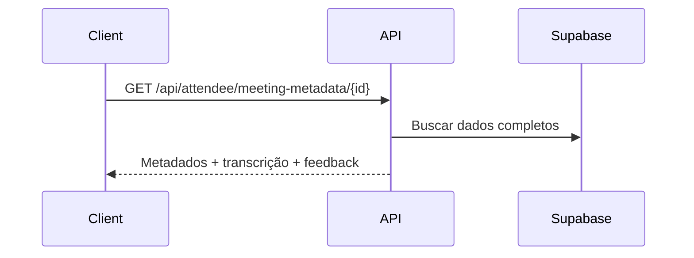
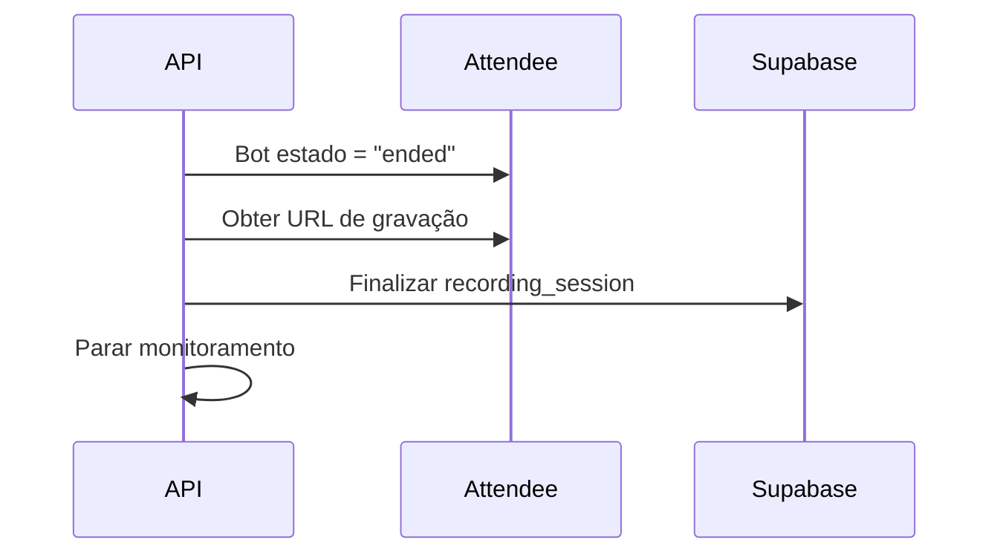

# 📋 **Documentação da Integração Attendee**

## 🎯 **Resumo da Implementação**

Esta implementação adiciona integração completa com a API do Attendee para gravação e transcrição de reuniões, substituindo o sistema próprio de gravação por uma solução profissional que suporta Teams, Zoom e Google Meet.

## 🏗️ **Mudanças na Arquitetura**

### **1. Tabelas do Banco (Supabase)**

#### **Modificações na `recording_sessions`:**
```sql
-- Colunas adicionadas para Attendee
ALTER TABLE recording_sessions ADD COLUMN:
- attendee_bot_id VARCHAR           -- ID do bot criado no Attendee
- attendee_meeting_url VARCHAR      -- URL da reunião processada
- attendee_bot_state VARCHAR        -- Estado do bot (ready, joining, etc.)
- attendee_recording_state VARCHAR  -- Estado da gravação (in_progress, complete)
- attendee_transcription_state VARCHAR -- Estado da transcrição
- transcription_data JSONB          -- Array de transcrições com timestamps
- feedback_analysis JSONB           -- Análise de feedback gerada pelo Gemini
- speaker_data JSONB                -- Dados dos falantes identificados
- last_transcript_check_at TIMESTAMP -- Última verificação de transcrição
- bot_monitoring_active BOOLEAN     -- Se o monitoramento está ativo
- attendee_metadata JSONB           -- Metadados do bot Attendee
```

#### **Utilização das Tabelas Existentes:**
- **`meeting_sessions`**: Mantida como antes, representa a sessão de reunião
- **`calendar_events`**: Relacionamento via `event_id` quando a reunião vem de calendário
- **`recording_sessions`**: Expandida para incluir dados do Attendee

### **2. Novos Serviços**

#### **`AttendeeIntegrationService`** (`app/attendee_service.py`)
- **Função**: Interface com a API do Attendee
- **Métodos principais**:
  - `create_bot()` - Cria bot no Attendee
  - `get_bot_status()` - Obtém status do bot
  - `get_transcript()` - Recupera transcrições
  - `get_recording_url()` - Obtém URL de gravação
  - `generate_feedback_analysis()` - Gera análise com Gemini

#### **`AttendeeMonitoringService`** (`app/attendee_service.py`)
- **Função**: Monitoramento contínuo dos bots
- **Características**:
  - Executa em background (asyncio tasks)
  - Verifica status do bot a cada 30 segundos
  - Atualiza transcrições automaticamente
  - Gera feedback com Gemini baseado na transcrição
  - Para automaticamente quando reunião termina

### **3. Extensão da Persistência**

Novos métodos adicionados ao `SupabasePersistenceService`:

```python
# Criação de sessões Attendee
create_attendee_recording_session()

# Atualizações durante monitoramento
update_attendee_bot_status()
update_transcript_and_feedback()
update_final_recording_url()

# Finalização
finalize_attendee_recording()

# Consulta completa
get_meeting_session_metadata()
```

## 🚀 **Novos Endpoints**

### **1. Iniciar Gravação Attendee**
```http
POST /api/attendee/start-recording
```

**Request:**
```json
{
  "meeting_url": "https://teams.microsoft.com/meet/xxx",
  "session_name": "Reunião de Planejamento Q4",
  "source_type": "live_recording",
  "event_id": "uuid-do-evento-calendario", // opcional
  "user_id": "uuid-do-usuario",
  "tenant_id": "uuid-do-tenant", // opcional
  "metadata": {
    "department": "Engineering",
    "project": "Q4 Planning"
  }
}
```

**Response:**
```json
{
  "recording_session_id": "uuid-da-recording-session",
  "meeting_session_id": "uuid-da-meeting-session", 
  "attendee_bot_id": "bot_xxx",
  "session_name": "Reunião de Planejamento Q4",
  "meeting_url": "https://teams.microsoft.com/meet/xxx",
  "status": "active",
  "monitoring_active": true,
  "created_at": "2025-08-31T10:00:00Z",
  "message": "Gravação iniciada com sucesso. Bot ID: bot_xxx"
}
```

### **2. Obter Metadados da Reunião**
```http
GET /api/attendee/meeting-metadata/{recording_session_id}
```

**Response:**
```json
{
  "recording_session_id": "uuid",
  "meeting_session_id": "uuid",
  "session_name": "Reunião de Planejamento Q4",
  "meeting_url": "https://teams.microsoft.com/meet/xxx",
  "status": "active", // active, completed, failed
  "attendee_bot_id": "bot_xxx",
  "attendee_bot_state": "joined_recording", // Estado do bot
  "attendee_recording_state": "in_progress", // Estado da gravação
  "attendee_transcription_state": "in_progress", // Estado da transcrição
  "transcription_data": [
    {
      "speaker_name": "João Silva",
      "speaker_uuid": "speaker_123",
      "timestamp_ms": 1630000000000,
      "duration_ms": 5000,
      "transcription": {
        "transcript": "Bom dia pessoal, vamos começar nossa reunião",
        "words": [...] // Word-level timestamps
      }
    }
  ],
  "feedback_analysis": {
    "resumo_geral": "Reunião focada em planejamento estratégico...",
    "pontos_principais": ["Definição de metas Q4", "Alocação de recursos"],
    "acoes_pendentes": ["Revisar orçamento", "Definir cronograma"],
    "feedback_participacao": {
      "distribuicao_fala": "Equilibrada entre participantes",
      "engajamento": "Alto nível de participação",
      "dinamica": "Reunião bem estruturada"
    },
    "insights_pnl": {
      "tom_geral": "Colaborativo e focado",
      "momentos_criticos": ["Discussão sobre deadline", "Aprovação do orçamento"],
      "oportunidades_melhoria": ["Mais tempo para Q&A"]
    },
    "metricas": {
      "total_falantes": 5,
      "duracao_estimada_min": 45,
      "nivel_colaboracao": "Alto"
    },
    "generated_at": "2025-08-31T10:30:00Z",
    "transcript_segments": 25
  },
  "speaker_data": [...],
  "final_recording_url": "https://attendee-storage.s3.amazonaws.com/...", // quando disponível
  "calendar_event_title": "Reunião de Planejamento Q4", // se veio do calendário
  "total_chunks": 25,
  "monitoring_active": true,
  "created_at": "2025-08-31T10:00:00Z",
  "updated_at": "2025-08-31T10:30:00Z",
  "ended_at": null // quando finalizar
}
```

### **3. Parar Monitoramento**
```http
POST /api/attendee/stop-recording/{recording_session_id}
```

## 🔄 **Fluxo Completo**

### **1. Início da Gravação**


### **2. Monitoramento Contínuo**


### **3. Consulta de Metadados**


### **4. Finalização Automática**


## ⚙️ **Configuração Necessária**

### **Variáveis de Ambiente:**
```bash
# API do Attendee
ATTENDEE_API_KEY=token_your_api_key_here

# Gemini para análise de feedback (já existente)
GEMINI_API_KEY=your_gemini_key

# Supabase (já existente)
SUPABASE_DB_HOST=...
SUPABASE_DB_USER=...
SUPABASE_DB_PASSWORD=...
```

### **Executar Migração SQL:**
```bash
# Aplicar as mudanças na tabela recording_sessions
psql -h your-host -U your-user -d postgres -f sql/recording_sessions_attendee_migration.sql
```

## 🎯 **Vantagens da Nova Implementação**

### **1. Funcionalidades Profissionais**
- ✅ Suporte nativo a Teams, Zoom, Google Meet
- ✅ Transcrição em tempo real com diarização
- ✅ Qualidade de gravação superior
- ✅ Detecção automática de fim de reunião
- ✅ Gestão de participantes e permissões

### **2. Escalabilidade**
- ✅ Múltiplas gravações simultâneas
- ✅ Infraestrutura gerenciada pelo Attendee
- ✅ Monitoramento assíncrono eficiente
- ✅ Recuperação automática de falhas

### **3. Análise Inteligente**
- ✅ Feedback PNL em tempo real
- ✅ Insights de participação e dinâmica
- ✅ Identificação de momentos críticos
- ✅ Sugestões de melhoria

### **4. Integração Flexível**
- ✅ Funciona com ou sem eventos de calendário
- ✅ Metadados customizáveis
- ✅ API RESTful simples
- ✅ Compatível com arquitetura existente

## 🚀 **Como Usar**

### **1. Iniciar Gravação Simples**
```bash
curl -X POST "https://your-api.com/api/attendee/start-recording" \
  -H "X-API-Token: your-token" \
  -H "Content-Type: application/json" \
  -d '{
    "meeting_url": "https://teams.microsoft.com/meet/xxx",
    "session_name": "Daily Standup",
    "user_id": "user-uuid"
  }'
```

### **2. Monitorar Progresso**
```bash
curl "https://your-api.com/api/attendee/meeting-metadata/recording-session-id" \
  -H "X-API-Token: your-token"
```

### **3. Parar Monitoramento** 
```bash
curl -X POST "https://your-api.com/api/attendee/stop-recording/recording-session-id" \
  -H "X-API-Token: your-token"
```

## 📊 **Comparação: Antes vs Depois**

| Aspecto | Implementação Anterior | Nova Implementação Attendee |
|---------|----------------------|------------------------------|
| **Plataformas** | Apenas Teams | Teams + Zoom + Google Meet |
| **Qualidade** | Dependente do ambiente | Profissional e consistente |
| **Transcrição** | Gemini pós-processamento | Tempo real com diarização |
| **Escalabilidade** | Limitada por recursos | Ilimitada (infraestrutura externa) |
| **Manutenção** | Alta (Playwright, FFmpeg) | Baixa (API gerenciada) |
| **Confiabilidade** | Sujeita a mudanças do Teams | Estável e suportada |
| **Custos** | Infraestrutura própria | Por uso (mais previsível) |

Esta implementação mantém total compatibilidade com a arquitetura existente enquanto adiciona funcionalidades profissionais através da integração com o Attendee.
